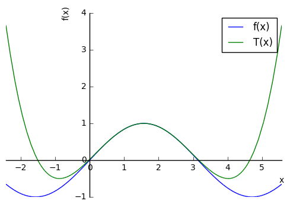
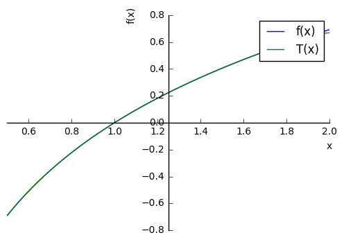

## Basic sympy setting


```python
%reset -f             
from sympy import *    # import everything from sympy module
init_printing()        # for nice math output 

## forcing plots inside browser
%matplotlib inline
```

###  Declare symbolic variables


```python
x = symbols('x')
```

### Example 1

Find 4-th degree Taylor polynomial of $$ f(x) = \sin(x)$$ at $$a = \frac{\pi}{2}$$. Plot $$f(x)$$ and Taylor polynomial on the same window


```python
## Finding Taylor polynomial

a = pi/2
f = sin(x)

T = f.subs(x,a) \
    + diff(f,x,1).subs(x,a)*(x-a)  \
    + diff(f,x,2).subs(x,a)*(x-a)**2/2 \
    + diff(f,x,3).subs(x,a)*(x-a)**3/factorial(3) \
    + diff(f,x,4).subs(x,a)*(x-a)**4/factorial(4)
  
T
  
```


$$\frac{1}{24} \left(x - \frac{\pi}{2}\right)^{4} - \frac{1}{2} \left(x - \frac{\pi}{2}\right)^{2} + 1$$


```python
## plotting f(x) and T(x) in same window


p = plot(f,T, (x,a - 4, a + 4),show=False, legend=True)

p[0].line_color = 'blue'
p[1].line_color = 'green'

p[0].label      = 'f(x)'
p[1].label      = 'T(x)'

p.show()
```





### Example 2

Find 20-th degree Taylor polynomial of $$ f(x) = \log(x) $$ at $$ a = 1 $$. Plot $$ f(x) $$ and Taylor polynomial on the same window


```python
## evaluation of T

a = 1
n = 20
f = log(x)

T = f.subs(x,a)

for k in range(1,n+1):
    df = diff(f,x,k)
    T = T + df.subs(x,a)*(x-a)**k/factorial(k)
    
T
```


$$x - \frac{1}{20} \left(x - 1\right)^{20} + \frac{1}{19} \left(x - 1\right)^{19} - \frac{1}{18} \left(x - 1\right)^{18} + \frac{1}{17} \left(x - 1\right)^{17} \\\\ - \frac{1}{16} \left(x - 1\right)^{16} + \frac{1}{15} \left(x - 1\right)^{15} - \frac{1}{14} \left(x - 1\right)^{14} + \frac{1}{13} \left(x - 1\right)^{13} - \frac{1}{12} \left(x - 1\right)^{12} + \\\\ \frac{1}{11} \left(x - 1\right)^{11} - \frac{1}{10} \left(x - 1\right)^{10} + \frac{1}{9} \left(x - 1\right)^{9} - \frac{1}{8} \left(x - 1\right)^{8} + \\\\ \frac{1}{7} \left(x - 1\right)^{7} - \frac{1}{6} \left(x - 1\right)^{6} + \frac{1}{5} \left(x - 1\right)^{5} - \frac{1}{4} \left(x - 1\right)^{4} +  \\\\ \frac{1}{3} \left(x - 1\right)^{3} - \frac{1}{2} \left(x - 1\right)^{2} - 1$$


```python
## plotting f(x) and T(x) in same window


p = plot(f,T, (x, 0.5, 2),show=False, legend=True)

p[0].line_color = 'blue'
p[1].line_color = 'green'

p[0].label      = 'f(x)'
p[1].label      = 'T(x)'

p.show()
```





```python

```
