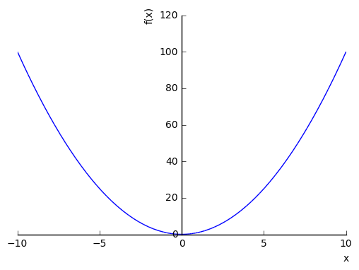
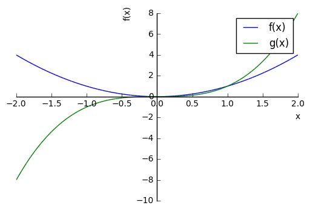
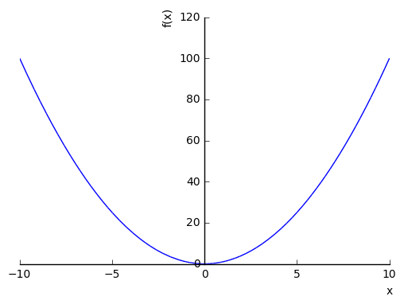

## Setting up python environment


```python
# reset all previously defined varibles
%reset -f

# import everything from sympy moduleb 
from sympy import *

# pretty math formatting
init_printing()   # latex
```

### Symbolic variables must be declared


```python
x,y,z = symbols('x y z')
```

###  Function definition


```python
## Example 1

f = 2*x**3  # define function
f           # print function

```


$$2 x^{3}$$


```python
## Example 2

g = x**2 + x*y**2 # define function
g           # print function
```


$$x^{2} + x y^{2}$$


### Function Evaluation


```python
# f(0)
f.subs(x,0)
```


$$0$$


```python
# f(1)
f.subs(x,1)
```


$$2$$


```python
# g(x=2,y=3)
g.subs([(x,2),(y,3)])
```


$$22$$


## Plotting


```python
## Graph of f = x^2

f = x**2

plot(f)
```





    <sympy.plotting.plot.Plot at 0x7f5b50e6a410>


```python
## multiple graph in same window

f = x**2
g = x**3

p = plot(f,g, (x, -2, 2),show=False, legend=True  )

p[0].line_color = 'blue'
p[1].line_color = 'green'


p[0].label      = 'f(x)'
p[1].label      = 'g(x)'
p.show()

```





```python
## undocking plots out of browser
%matplotlib qt  

f = x**2
plot(f)

```


    <sympy.plotting.plot.Plot at 0x7f5b173ce850>


```python
## forcing plots inside browser
%matplotlib inline

f = x**2
plot(f)
```





    <sympy.plotting.plot.Plot at 0x7f5b2c0869d0>


```python

```
