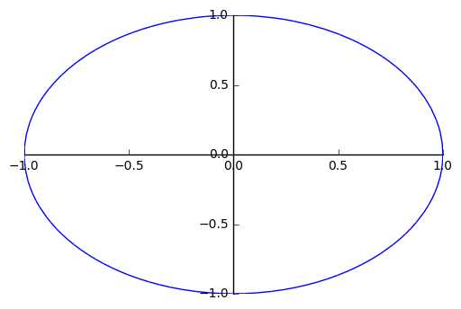
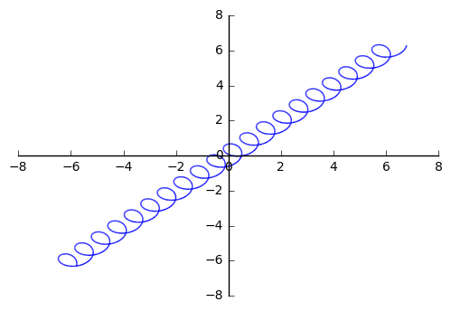
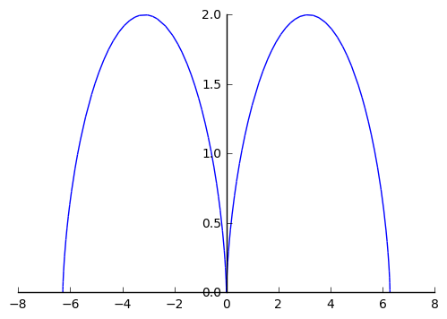
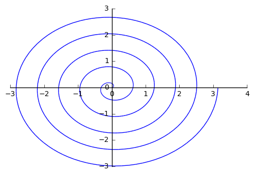
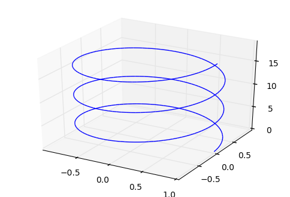
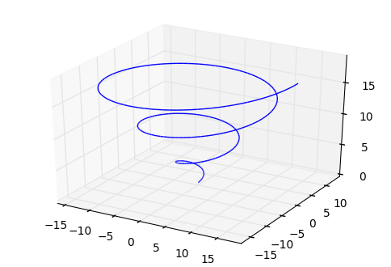

### Import sympy parametric plot modules


```python
%reset -f             
from sympy import *    
from sympy.plotting import plot_parametric
from sympy.plotting import plot3d_parametric_line
import math

init_printing()        # for nice math output 

# uncomment for plot in separate window
# %matplotlib qt        

# uncomment for plot inline --- DEFAULT
%matplotlib inline  
```

### Declare symbolic variables


```python
t = symbols('t')
```


```python
# 2d - Example 1 
x = cos(t)
y = sin(t)
plot_parametric(x, y, (t, 0, 2*pi))
```





    <sympy.plotting.plot.Plot at 0x7f40c833c650>


```python
# 2d - Example 2
x = t + 0.5 * cos(10*t)
y = t + 0.5 * sin(10*t)
plot_parametric(x, y, (t, -2*pi, 2*pi))
```





    <sympy.plotting.plot.Plot at 0x7f40a4f03b50>


```python
# 2d - Example 3 - Cycloid
x = t - sin(t)
y = 1 - cos(t)
plot_parametric(x, y, (t, -2*pi, 2*pi))
```





    <sympy.plotting.plot.Plot at 0x7f40a4f03cd0>


```python
# 2d - Example 4 
x = 0.1*t*cos(t)
y = 0.1*t*sin(t)
plot_parametric(x, y, (t, 0, 10*pi))
```





    <sympy.plotting.plot.Plot at 0x7f40a177f950>


```python
# 3d - Example 1 
x = cos(t)
y = sin(t)
z = t

plot3d_parametric_line(x, y, z, (t, 0, 6*math.pi))

```





    <sympy.plotting.plot.Plot at 0x7f40a18da410>


```python
# 3d - Example 2
x = t*cos(t)
y = t*sin(t)
z = t

plot3d_parametric_line(x, y, z, (t, 0, 6*math.pi))
```





    <sympy.plotting.plot.Plot at 0x7f40a177f190>


```python

```
