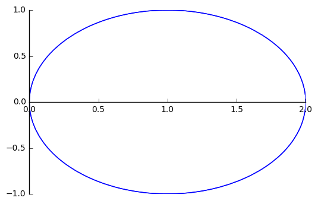
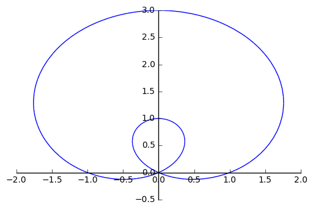
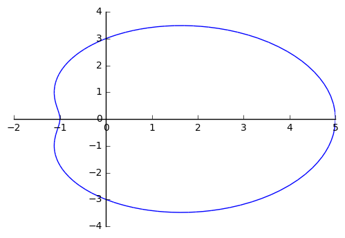
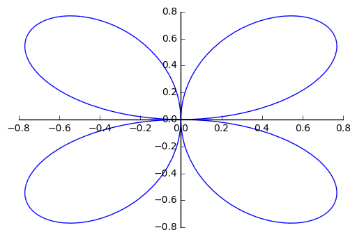
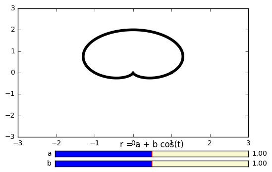
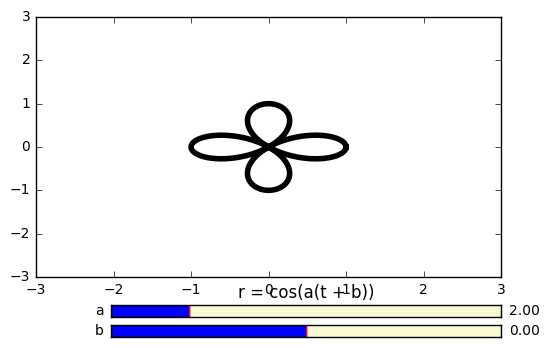

# Import sympy parametric plot modules


```python
%reset -f             
from sympy import *    
from sympy.plotting import plot_parametric
from sympy.plotting import plot3d_parametric_line
import math

init_printing()        # for nice math output 

# uncomment for plot in separate window
%matplotlib qt        

# uncomment for plot inline --- DEFAULT
#%matplotlib inline  
```

## Declare symbolic variables


```python
t = symbols('t')
```

## Example: Plot the polar curve $$r = 2\cos(t)$$


```python
# 2d - Example 1 
r = 2*cos(t)

%matplotlib inline
plot_parametric( r*cos(t), r*sin(t), (t, 0, 2*pi))
```





    <sympy.plotting.plot.Plot at 0x7f2934e96690>


## Example: Plot the polar curve $$ r = 1 + 2 \sin(t)$$


```python
r = 1 + 2*sin(t)

%matplotlib inline
plot_parametric( r*cos(t), r*sin(t), (t, 0, 2*pi))
```





    <sympy.plotting.plot.Plot at 0x7f2934e96490>


## Example: Plot the polar curve $$r = 3 + 2\cos(t)$$


```python
r = 3 + 2*cos(t)

%matplotlib inline
plot_parametric( r*cos(t), r*sin(t), (t, 0, 2*pi))
```





    <sympy.plotting.plot.Plot at 0x7f292551cf90>


## Example: Plot the polar curve $$r = \sin(3t)$$


```python
r = sin(2*t)

%matplotlib inline
plot_parametric( r*cos(t), r*sin(t), (t, 0, 2*pi))
```





    <sympy.plotting.plot.Plot at 0x7f2925410450>


## Example: Plot the family of curve curve $$r = a + b \sin(t)$$ with slidable $$a$$ and $$b$$. 


```python
%reset -f
%matplotlib qt

import numpy as np
import matplotlib.pyplot as plt
from matplotlib.widgets import Slider

plt.subplots_adjust(bottom=0.25)
t = np.arange(0.0, 2*np.pi, 0.001)

a = 1   
b = 1   
r = a + b*np.sin(t)
x = r*np.cos(t)
y = r*np.sin(t)


l, = plt.plot(x,y, lw=4, color='black')
plt.axis([-3, 3, -3, 3])

axcolor = 'lightgoldenrodyellow'
axb  = plt.axes([0.25, 0.10, 0.65, 0.03], axisbg=axcolor)
axa = plt.axes([0.25, 0.15, 0.65, 0.03], axisbg=axcolor)

sa = Slider(axa, 'a', 0, 2, valinit=a)
sb = Slider(axb, 'b', 0, 2, valinit=b)

def update(val):
    a = sa.val     
    b = sb.val   
    
    r = a + b*np.sin(t)
    x = r*np.cos(t)
    y = r*np.sin(t)
    
    l.set_ydata(y)
    l.set_xdata(x)    
    fig.canvas.draw_idle()
    
sa.on_changed(update)
sb.on_changed(update)
plt.title('r = a + b cos(t)')

plt.show()
```





## Example: Plot the family of curve curve $$r =  \sin[a(t+b)]$$ with slidable $$a$$ and $$b$$. 


```python
%reset -f
%matplotlib qt

import numpy as np
import matplotlib.pyplot as plt
from matplotlib.widgets import Slider


plt.subplots_adjust(bottom=0.25)
t = np.arange(0.0, 2*np.pi, 0.001)

a = 2   
b = 0 
r = np.cos(a*(t + b))
x = r*np.cos(t)
y = r*np.sin(t)


l, = plt.plot(x,y, lw=4, color='black')
plt.axis([-3, 3, -3, 3])

axcolor = 'lightgoldenrodyellow'
axb  = plt.axes([0.25, 0.10, 0.65, 0.03], axisbg=axcolor)
axa = plt.axes([0.25, 0.15, 0.65, 0.03], axisbg=axcolor)

sa = Slider(axa, 'a', 0, 10, valinit=a)
sb = Slider(axb, 'b', -np.pi, np.pi, valinit=b)

def update(val):
    a = (sa.val)     
    b = sb.val
 
    
    r = np.cos(a*(t + b))
    x = r*np.cos(t)
    y = r*np.sin(t)

    l.set_ydata(y)
    l.set_xdata(x)    
    fig.canvas.draw_idle()
    
sa.on_changed(update)
sb.on_changed(update)
plt.title('r = cos(a(t + b))')

plt.show()
```





```python

```
