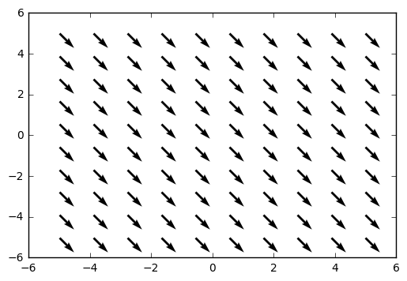
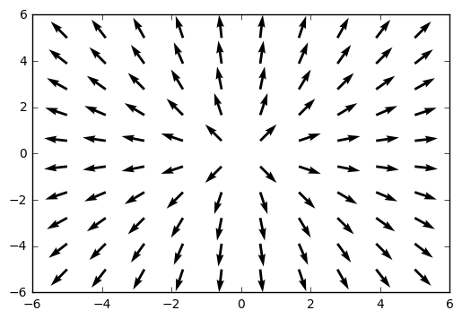
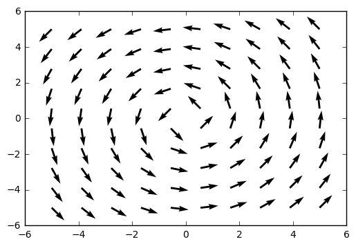
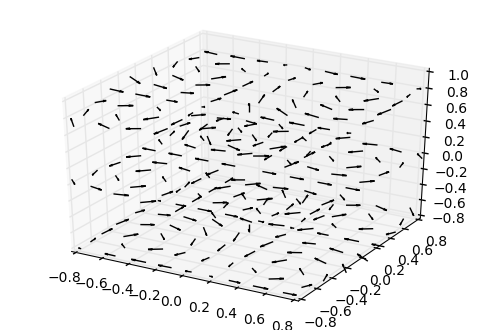

# Vector Fields

**Example:** Plot of vector field 
$$\vec{F}(x,y) = \mathbf{i}  - \mathbf{j}$$


```python
import numpy as np
import matplotlib.pyplot as plt
%matplotlib inline

x,y = np.meshgrid(np.linspace(-5,5,10),np.linspace(-5,5,10))

u = 1
v = -1

plt.quiver(x,y,u,v)
plt.show()
```





**Example:** Plot of vector field 
$$\vec{F}(x,y) = \frac{x}{\sqrt{x^2 + y^2}} \mathbf{i} + \frac{y}{\sqrt{x^2 + y^2}} \mathbf{j}$$


```python
import numpy as np
import matplotlib.pyplot as plt
%matplotlib inline

x,y = np.meshgrid(np.linspace(-5,5,10),np.linspace(-5,5,10))

u = x/np.sqrt(x**2 + y**2)
v = y/np.sqrt(x**2 + y**2)

plt.quiver(x,y,u,v)
plt.show()
```





**Example:** Plot of vector field 
$$\vec{F}(x,y) = -\frac{y}{\sqrt{x^2 + y^2}} \mathbf{i} + \frac{x}{\sqrt{x^2 + y^2}} \mathbf{j}$$


```python
import numpy as np
import matplotlib.pyplot as plt
%matplotlib inline

x,y = np.meshgrid(np.linspace(-5,5,10),np.linspace(-5,5,10))

u = -y/np.sqrt(x**2 + y**2)
v = x/np.sqrt(x**2 + y**2)

plt.quiver(x,y,u,v)
plt.show()
```





```python
plt.quiverkey?
```

# 3d Vector Field 


```python
%reset -f
from mpl_toolkits.mplot3d import axes3d
import matplotlib.pyplot as plt
import numpy as np
%matplotlib inline


fig = plt.figure()
ax = fig.gca(projection='3d')

x, y, z = np.meshgrid(np.arange(-0.8, 1, 0.2),
                      np.arange(-0.8, 1, 0.2),
                      np.arange(-0.8, 1, 0.8))

u = np.sin(np.pi * x) * np.cos(np.pi * y) * np.cos(np.pi * z)
v = -np.cos(np.pi * x) * np.sin(np.pi * y) * np.cos(np.pi * z)
w = (np.sqrt(2.0 / 3.0) * np.cos(np.pi * x) * np.cos(np.pi * y) *
     np.sin(np.pi * z))

ax.quiver(x, y, z, u, v, w, length=0.1, color = 'black')

plt.show()
```





```python

```
