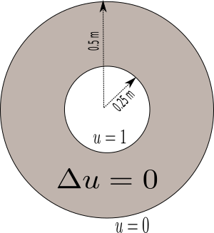
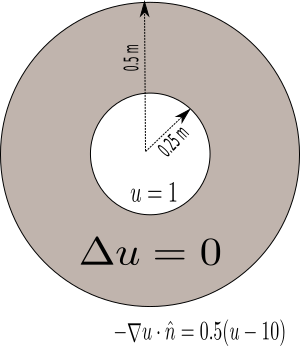

<!---
#+latex_header: \newcommand{\Sig}{\Sigma}
#+latex_header: \newcommand{\Om}{\Omega}
#+latex_header: \newcommand{\om}{\omega}
#+latex_header: \newcommand{\Gm}{\Gamma}
#+latex_header: \newcommand{\tor}{\rightarrow}
#+latex_header: \newcommand{\R}{\mathbf{R}}
#+latex_header: \newcommand{\p}{\partial}
#+latex_header: \newcommand{\nl}{\nabla}
#+latex_header: \newcommand{\Dt}{\Delta}
#+latex_header: \newcommand{\dt}{\delta}
#+latex_header: \newcommand{\ep}{\epsilon}
#+latex_header: \newcommand{\vp}{\varphi}
#+latex_header: \newcommand{\ve}{\mathbf{\varepsilon}}
#+latex_header: \newcommand{\ml}{\left[\begin{array}}
#+latex_header: \newcommand{\mr}{\end{array}\right]}
#+latex_header: \newcommand{\divc}{\mathbf{div}}
--->

## Matlab pdetoolbox demo

A toolbox for solving 2d & 3d generic pde using Finite Element Method

------------

### Example 1:
Solving Poisson Equation on a Unit Disk
Follow along this <a href="https://in.mathworks.com/help/pde/ug/solve-poissons-equation-on-a-unit-disk-pde-app.html" target="_blank"> Matlab Tutorial </a> and try to answer these questions

* What was the domain?
* What was the equation?
* What were the boundary conditions?
* What is it that you just plotted?

------------

### Example 2: 
Solve the Poisson equation in the unit square

$$ 
\Dt(u) = 0, \qquad \textrm{for }   0 \le x,y, \le 1,
$$

with boundary conditions: $$u(y,0) = 0,  u(1,y) = 1 \;\forall y$$, and $$\frac{\p u}{\p y}(x,0) = \frac{\p u}{\p y}(x,1) =0 $$ for all $$  0 \le x \le 1$$.

------------

### Example 3: Poisson's Equation with Complex 2-D Geometry
Follow along this  <a href="https://in.mathworks.com/help/pde/ug/solving-a-pde.html" target="_blank"> Matlab Tutorial </a>  and try to answer these questions

* What was the domain?
* What was the equation?
* What were the boundary conditions?
* What is it that you just plotted?

------------

### Exercise 1: A shell with hot inside ring

------------

### Exercise 2: A shell with hot inside ring and Neumann boundary outside

------------

### Project 1: Solve a given PDE with slightly non trivial domain in matlab.

Ajit: coming shortly

--------------------

Using pdetoolbox over commandlines
----------------

Relevant pages from Matlab documentation

* <a href="https://in.mathworks.com/help/pde/ug/solve-problems-using-pdemodel-objects.html" target="_blank"> Matlab PDE workflow </a>
* <a href="https://in.mathworks.com/help/pde/ug/three-ways-to-create-2-d-geometry.html" target="_blank"> Geometry of 2 dimensional problems </a>
* <a href="https://in.mathworks.com/help/pde/ug/create-and-view-3-d-geometry.html" target="_blank"> Geometry of 3 dimensional problems </a>

Recommended steps:

* Create problems geometry with some GUI based application. Matlab pde app will work fine for 2d problems; I recommend using <a href="http://gmsh.info/" target="_blank"> Gmsh </a> for 3d problems. You can also try some equally good and also free alternatives like <a href="https://www.paraview.org/" target="_blank"> Paraview </a> or  <a href="http://www.salome-platform.org/" target="_blank">Salome</a>.

### Exercise 1

Solve the problem shown in the figure below using the pdetool app

Then 

* Save the app data as exercise1.m
* Modify the script exercise1.m so that innercircle is cold and outer circle hot. 
* Study every line in the exercise1.m and find (either guess or look into matlab documentation) what that line does.

